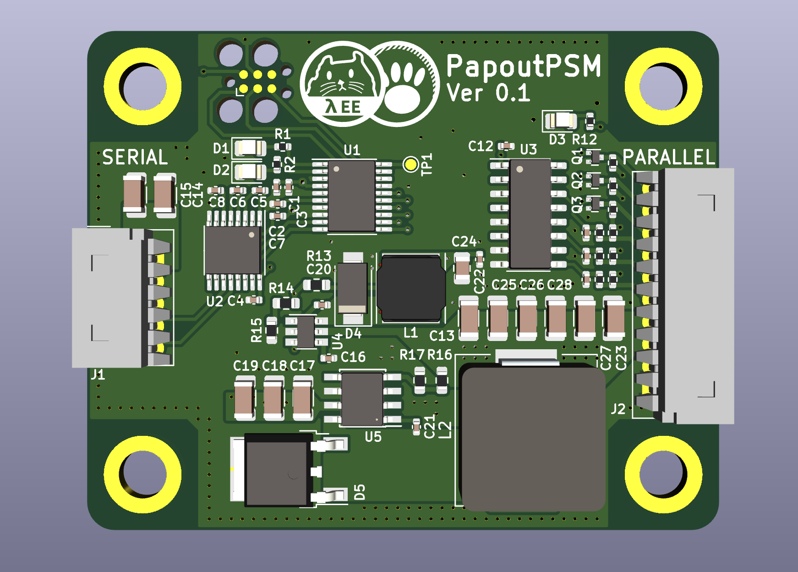
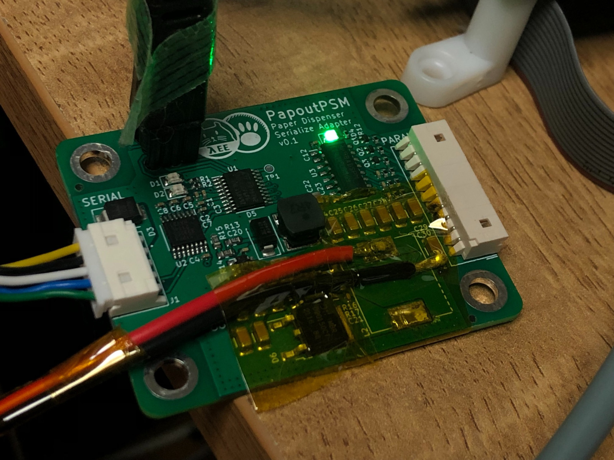
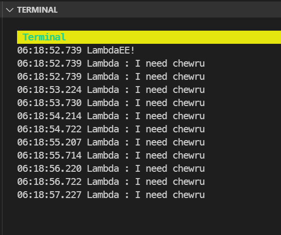

# `papout-psm-rs`

| 3D Model | Real Image |
| -------- | ---------- |
|  |  |
| Kicad 5.99 Modeling | 24v->12v dcdc have a problem |
_Currently working with PCB modification on DCDC_

## Experimental firmware project with **RUST** and **STM32G0**.

Parallel to Serial Adapter for Korean Paper Dispenser Machine.
Some wellknown korean paper dispenser have two type of device.
Serial model communicate to host with RS232.
Parallel model communicate with open-drain based on to pull-up lines (3in/3out).


- HW repo : `release asap` (Kicad 5.99) 
- HW Schematics : [Schematic](docs/PapoutPSM-HW-Schematics.pdf)
- Used MCU : `STM32G031F8P6` (Cortex-M0+, 32KiB Flash, 8KiB SRAM, TSSOP-20)
- GPIO Assign Map : [Peripheral](docs/Peripheral.md)


## Other Info
- Binary Size Notes : [Binary Size Notes](docs/BinarySize.md)
- OpenOcd Issue Notes : [OpenOcd Issue Notes](docs/OpenOcdIssue.md)
- Vscode Related Notes : [VSCODE](.vscode/README.md)
- RTIC Useful document (v0.6 alpha) : https://rtic.rs/dev/book/en/by-example/tasks.html

## Flashing
- Flashing : https://probe.rs/docs/tools/cargo-flash/
```shell
cargo flash --release --chip STM32G031F8Px
```

## Debug - Fancy
```shell
cargo install cargo-flash
cargo install probe-rs-cli
cargo install --git https://github.com/probe-rs/probe-rs probe-rs-debugger
# Install probe-rs-debugger for Vscode with latest VSIX
# https://github.com/probe-rs/vscode/releases

probe-rs-debugger debug --chip STM32G031F8Px --speed 2000 --probe 0483:374f --program-binary target/thumbv6m-none-eabi/debug/papout-psm-rs --protocol swd --connect-under-reset  --core-index 0 --flashing-enabled --reset-after-flashing --halt-after-reset
```

## Debuging with RTT-Target 

```
# Install cargo-embed if you don't have
cargo install cargo-embed
cargo-embed --chip STM32G031F8Px
```
cargo-embed serve you terminal between target and host through rust and SWD.

## Debug - Traditional

```shell
# Other terminal
openocd
# Main Terminal
cargo run
target extended-remote :3333
load
monitor arm semihosting enable
break idle
continue
```

## License
- MIT license ([LICENSE-MIT](LICENSE-MIT) or http://opensource.org/licenses/MIT)